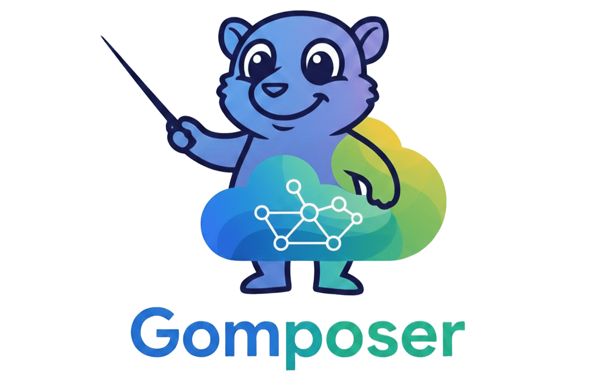
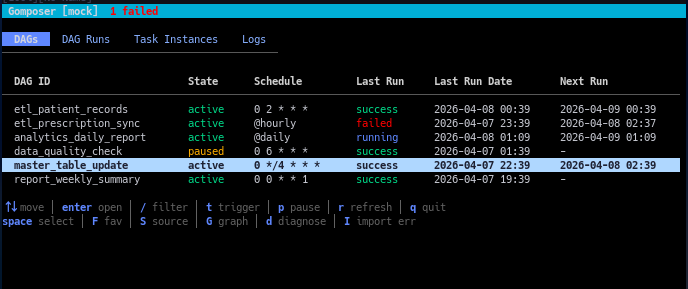

<!-- 


-->


<h1><div align="left">Gomposer <br> - Cloud Composer (Apache Airflow) TUI</div></h1>

<!-- 
### Pain points in Cloud Composer operations:

Cloud Composer の運用では、ちょっとした確認や操作のたびに手数がかかる:

- **たどり着くまでが遠い** — GCP コンソール → Composer → Airflow Web UI と何度もクリックして、ようやく DAG 一覧にたどり着く
- **環境の切り替えが煩雑** — qa と prod を行き来するたびにブラウザのタブが増えていく
- **障害調査のドリルダウンが深い** — DAG が失敗したとき、DAG → DAG Run → Task Instance → ログと何階層も掘らないとエラー原因にたどり着けない
- **ちょっとした操作にブラウザが要る** — DAG のトリガーや Pause/Unpause をするだけなのに毎回 Web UI を開く必要がある

Gomposer はこれらをターミナル上のキーボード操作に集約する。起動して即 DAG 一覧、Enter でドリルダウン、`t` でトリガー、`E` で環境切り替え。ブラウザを開かずに日常の Composer 運用が完結する。
-->



## Requirements

- Go 1.24 ~
- GCP に接続する場合: `gcloud` CLI がインストール済みで認証済みであること

## Installation
- 
```bash
mise install
mise run build

# mise の Go backend でグローバルインストール可能
go install github.com/shiroimon/gomposer/cmd@latest
```
- 
```bash
# Makefile
make build        # → bin/gomposer
make install      # → $GOPATH/bin/gomposer
```

## Usage

```bash
gomposer --help
gomposer --version

# モックデータで起動（API 接続不要）
gomposer --mock

# config.toml の設定で Cloud Composer に接続
gomposer

# 環境を指定して起動
gomposer --env prod

# 設定ファイルのパスを指定
gomposer --config /path/to/config.toml
```

---

## 設定ファイル

`sample.config.toml` をコピーして `config.toml` として使用してください。

```toml
[environments.qa]
name = "qa"
webserver_url = "https://xxxxx-dot-us-central1.composer.googleusercontent.com"
color_theme = "blue"

[environments.prod]
name = "prod"
webserver_url = "https://xxxxx-dot-us-central1.composer.googleusercontent.com"
color_theme = "red"

[default]
environment = "qa"

[ui]
# 自動リフレッシュ間隔（秒）。0 = 無効
refresh_interval_sec = 30
```

| 設定項目 | 説明 |
|---------|------|
| `environments.<key>.webserver_url` | Airflow Webserver の URL |
| `environments.<key>.color_theme` | アクセントカラー (`red` / `blue` / `green` / `yellow` / `default`) |
| `default.environment` | デフォルトで接続する環境名 |
| `ui.refresh_interval_sec` | 自動リフレッシュ間隔（秒）。`0` で無効 |

---

## Key maps

### 共通

| キー | 操作 |
|------|------|
| `j` / `k` / `↑` / `↓` | 行選択・スクロール |
| `Enter` | 選択項目に遷移 |
| `Esc` / `Backspace` | 前の画面に戻る |
| `r` | データ再取得 |
| `q` | 終了 |

### DAG 一覧

| キー | 操作 |
|------|------|
| `/` | 検索フィルター入力 |
| `t` | DAG をトリガー |
| `p` | Pause / Unpause 切り替え |
| `Space` | DAG を選択（複数選択） |
| `F` | お気に入り登録・解除 |
| `S` | DAG ソースコード表示 |
| `G` | DAG 依存グラフ表示 |
| `d` | 障害診断レポート |
| `E` | 環境切り替え（複数環境時） |

### DAG Run 一覧

| キー | 操作 |
|------|------|
| `s` / `f` | Run を success / failed にマーク |

### Task Instance 一覧

| キー | 操作 |
|------|------|
| `c` | タスクをクリア |
| `C` | Run 内の全タスクをクリア |
| `x` | XCom エントリ表示 |

### ログ画面

| キー | 操作 |
|------|------|
| `g` / `G` | 先頭 / 末尾にジャンプ |
| `/` | ログ内検索 |
| `n` / `N` | 次 / 前の検索結果へ |

---

## 画面構成

### メイン画面（タブ）
- **DAG 一覧** — DAG の一覧表示。お気に入りは上部に固定
- **DAG Run 一覧** — 選択した DAG の実行履歴。偽 success (`success*`) を自動検出
- **Task Instance 一覧** — Run 内のタスク一覧
- **ログ閲覧** — タスクログの表示。Airflow ログが空の場合は Cloud Logging にフォールバック

### オーバーレイ
- **XCom** — タスクの XCom キー・バリュー一覧
- **Graph** — DAG のタスク依存関係を ASCII グラフで表示
- **Source** — DAG の Python ソースコード
- **Diagnose** — 失敗 DAG・偽 success の一括診断レポート

---

## ディレクトリ構成

```
gomposer/
├── cmd/
│   └── main.go                    # エントリポイント
├── internal/
│   ├── api/
│   │   ├── auth.go                # gcloud トークン取得
│   │   ├── client.go              # DataSource インターフェース定義
│   │   ├── airflow.go             # Airflow REST API クライアント
│   │   ├── airflow_test.go
│   │   ├── mock.go                # モックデータソース
│   │   └── mock_test.go
│   ├── config/
│   │   ├── config.go              # TOML 設定読み込み
│   │   └── config_test.go
│   ├── model/
│   │   ├── dag.go                 # DAG 構造体
│   │   ├── dagrun.go              # DAG Run 構造体
│   │   ├── dagdetail.go           # DAG 詳細（グラフ・ソース用）
│   │   ├── taskinstance.go        # Task Instance 構造体
│   │   └── xcom.go                # XCom エントリ構造体
│   └── ui/
│       ├── app.go                 # ルート Model（Bubble Tea）
│       ├── daglist.go             # DAG 一覧画面
│       ├── daglist_test.go
│       ├── dagrun.go              # DAG Run 一覧画面
│       ├── dagrun_test.go
│       ├── taskinstance.go        # Task Instance 画面
│       ├── taskinstance_test.go
│       ├── logview.go             # ログ閲覧画面（検索付き）
│       ├── logview_test.go
│       ├── xcomview.go            # XCom 表示
│       ├── graphview.go           # DAG 依存グラフ（ASCII）
│       ├── diagnose.go            # 障害診断レポート
│       ├── cloudlog.go            # Cloud Logging フォールバック
│       ├── favorites.go           # お気に入り永続化
│       ├── tabs.go                # タブ切り替えロジック
│       ├── help.go                # キーバインドヘルプバー
│       └── styles.go              # Lip Gloss スタイル定義
├── Formula/
│   └── gomposer.rb                # Homebrew Formula
├── Makefile                       # ビルド・インストール
├── config.toml                    # 設定ファイル
├── sample.config.toml             # 設定ファイルサンプル
├── go.mod
├── go.sum
└── mise.toml
```

### 構成のポイント

- **`internal/`** — Go の慣習で外部パッケージからインポート不可にする
- **`ui/`** — 画面ごとに1ファイル。各ファイルが Bubble Tea の `Model` インターフェースを実装
- **`api/`** — `DataSource` インターフェースにより `mock.go` と `airflow.go` を透過的に切り替え可能
- **`model/`** — API レスポンスの JSON 構造体。`ui` と `api` 両方から参照

---

## License
MIT
